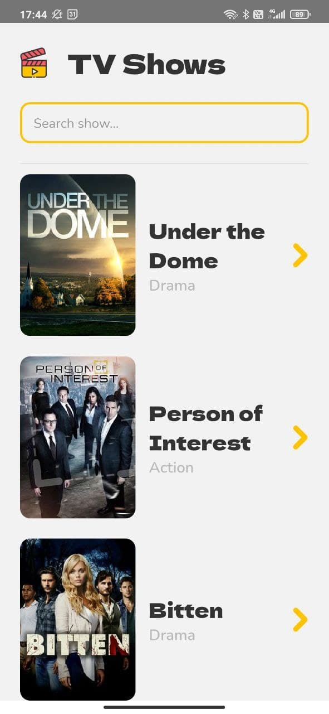

# TV Maze

Quest'applicazione è stata realizzata per un processo di selezione presso una compagnia di Torino.

L'applicazione ha il compito di mostrare le informazioni riguardanti le serie TV. Le informazioni sono prese deall API gratuita fornita da [tvmaze.com](https://www.tvmaze.com/).

L'applicazione è stata creata utilizzando il framework React Native che permette la creazione di applicazioni cross-platform iOS e Android.

Questo progetto è stato provato solamente su Android poichè per iOS sarebbe necessario avere un Mac.

  
   
  

